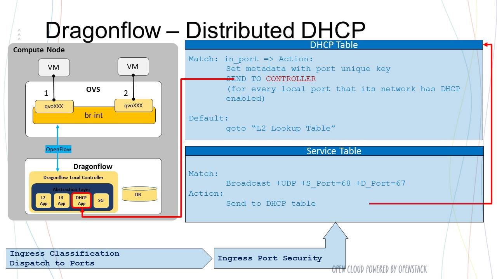
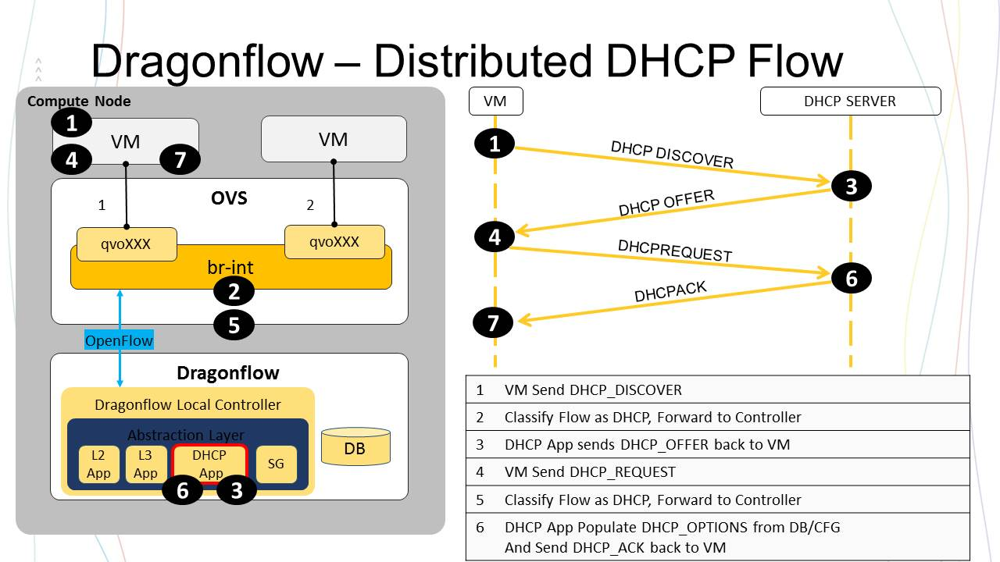

================
Distributed DHCP
================

Current Neutron Reference Implementation
========================================
The DHCP server is implemented using the Dnsmasq server
running in a namespace on the newtork-node per tenant subnet
that is configured with DHCP enabled.

Currently High availability is achieved by running multiple Dnsmasq
servers on multiple Network nodes.

There is a namespace with Dnsmasq server per tenant subnet

Problems with current DHCP implementation:

1) Management and Scalability
   - Need to configure and mange multiple Dnsmasq instances
2) Centralize solution depended on the network node

DHCP agent
----------
Same Concept as L3 agent and namespaces for virtual router.
Using black boxes that implement functionality and using them as the IaaS
backbone implementation

Distributed DHCP In Dragonflow
==============================
Dragonflow distribute DHCP policy/configuration using the pluggable DB.
Each local controller installs DHCP redirection openflow rules, to be
handle by the local controller.
Those rules are installed only for local ports that are
attached to a virtual network with DHCP enabled.

The controller set the flow metadata in the redirection rules
to the local port unique key as a hint to allow fast port info lookup
for the reactive DHCP packets handle by the DHCP application.

The local DHCP application handle the redirected DHCP packets and answer as a DHCP
server. DHCP traffic is handled directly at the compute node and never goes on
the network.

The following diagrams demonstrate this process:

