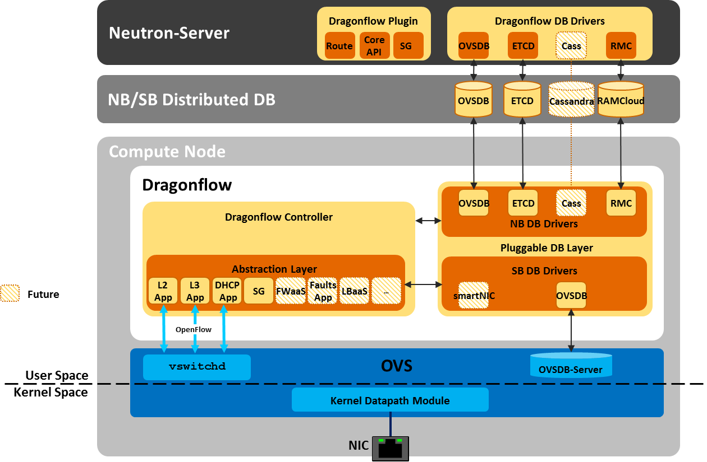

======================
Distributed Dragonflow
======================

Dragonflow is a distributed SDN controller for OpenStack® Neutron™
supporting distributed Switching, Routing, DHCP and more.

Our project mission is to implement advanced networking services in a
manner that is efficient, elegant and simple.

Dragonflow is designed to support large scale deployments with a focus on
latency and performance, as well as providing advanced innovative
services that run locally on each compute node, with container technology
in mind.

Mission Statement
-----------------

* Implement Neutron APIs using SDN principles, while keeping both
  Plug-in and Implementation fully under OpenStack project and
  governance.
* 100% open source, contributors are welcome to partner and share
  a mutual vision.
* Lightweight and Simple in terms of code size and complexity, so
  new users / contributors have a simple and fast ramp-up.
* Aim for performance-intensive environments, where latency is a
  big deal, while being small and intuitive enough to run on
  small ones as well.
* Completely pluggable design, easy to extend and enhance.
* We *truly* believe in a distributed control plane.

Key Design Guidelines
---------------------
* Pluggable database, determines scale, lookup performance and latency
* Policy-level/Topology abstraction synchronization to the Compute Node
* Local Dragonflow Controller uses Reactive model (where it makes sense)
* Loadable Network Services Framework

High Level Architecture
-----------------------

^^^^^^^^
Overview
^^^^^^^^
Dragonflow environment consist of a local controller running at each of the
compute nodes in the setup.

These controllers all sync the network topology and policy using a pluggable
DB solution.
The controllers then map the policy into OpenFlow flows using the local
Dragonflow applications that communicate with the local OpenVSwitch.

The DB is being populated by Dragonflow Neutron plugin that converts neutron
API to our model.

The following sections each describe a specific topic/functionality in Dragonflow

Dragonflow Supported Features
=============================
1) L2 core API, IPv4 , IPv6
    Supports GRE/VxLAN/Geneve tunneling protocols

2) Distributed virtual Router L3
    Supports a hybrid of proactive and reactive flow installation

3) Distributed DHCP

4) Pluggable Distributed Data Base
    ETCD, RethinkDB, RAMCloud, OVSDB

Dragonflow Pipeline
===================
`Dragonflow Pipeline <http://docs.openstack.org/developer/dragonflow/pipeline.html>`_

Dragonflow Pluggable DB
=======================
`Pluggable DB
<http://docs.openstack.org/developer/dragonflow/pluggable_db.html>`_

Distributed DHCP Application
============================

`Distributed DHCP Application
<http://docs.openstack.org/developer/dragonflow/distributed_dhcp.html>`_

Containers and Dragonflow
=========================
`Dragonflow and Containers <http://docs.openstack.org/developer/dragonflow/containers.html>`_

Dragonflow Roadmap
==================

The following topics are areas we are examining for future features and
roadmap into Dragonflow project

- Containers
- Distributed SNAT/DNAT
- Reactive DB
- Topology Service Injection / Service Chaining
- Smart NICs
- Hierarchical Port Binding (SDN ToR)
- Inter Cloud Connectivity (Boarder Gateway / L2GW)
- Fault Detection

How to Install
--------------

- `Installation Guide <http://docs.openstack.org/developer/dragonflow/readme.html>`_
- `DevStack Single Node Configuration
  <https://github.com/openstack/dragonflow/tree/master/doc/source/single-node-conf>`_
- `DevStack Multi Node Configuration
  <https://github.com/openstack/dragonflow/tree/master/doc/source/multi-node-conf>`_

Dragonflow Talks
----------------
- `Dragonflow - Neutron done the SDN Way - OpenStack Austin Summit
  <https://www.openstack.org/videos/video/dragonflow-neutron-done-the-sdn-way>`_
- `Dragonflow Introduction Video - OpenStack Tokyo Summit
  <https://www.youtube.com/watch?v=wo1Q-BL3nII>`_

More Useful Reading
-------------------
- `Distributed DHCP Service in Dragonflow
  <http://blog.gampel.net/2015/09/dragonflow-distributed-dhcp-for.html>`_
- `Centralized vs. Distributed SDN Controller in Dragonflow
  <http://blog.gampel.net/2015/08/centralized-vs-distributed-sdn-control.html>`_
- `Dragonflow in OpenStack Liberty
  <http://galsagie.github.io/2015/10/14/dragonflow-liberty/>`_
- `Dragonflow Distributed Database
  <http://galsagie.github.io/2015/08/03/df-distributed-db/>`_
- `Topology Service Injection
  <http://galsagie.github.io/2015/11/10/topology-service-injection/>`_
- `Dragonflow Security Groups Design at Scale
  <http://galsagie.github.io/2015/12/28/dragonflow-security-groups/>`_
- `Neutron DB Consistency
  <http://galsagie.github.io/2016/02/14/neutron-db-consistency/>`_
