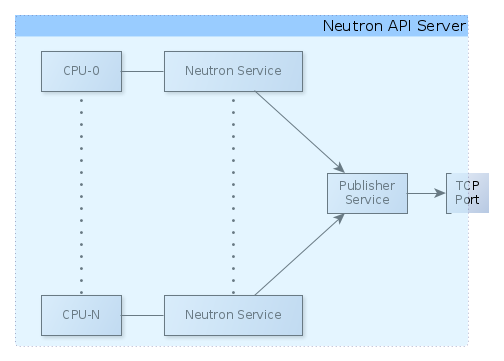

==========================================
Pluggable Publish-Subscribe Infrastructure
==========================================

This document describes the pluggable API for publish-subscribe and
publish-subscribe drivers. For the design, see the `spec
publish_subscribe_abstraction`__.

__ SPEC_

Instead of relying on the DB driver to support reliable publish-subscribe, we
allow pub/sub mechanisms to be integrated to Dragonflow in a pluggable way.

There are several Neutron API servers, and many compute nodes. Every compute
node registers as a subscriber to every Neutron API server, which acts as a
publisher.

This can be seen in the following diagram:

.. image:: ../images/pubsub_topology.png

Additionally, the Neutron server service is forked per the number of cores on
the server.

Since some publishers need to bind to a TCP socket, and we will want to run
monitoring services that need to run only once per server, and not once per
core, we provide a *publisher service*.

Therefore the communications between the Neutron service and the publisher
service requires an inter-process communications (IPC) solution.

This can also be solved using a publish-subscribe mechanism.

Therefore, there are two publish-subscribe implementations - a network-based
implementation between Neutron server and Compute node, and an IPC-based
implementation between Neutron services and the publisher service.

===
API
===

For simplicity, the API for both implementations is the same. It can be found
in ``dragonflow/db/pub_sub_api.py`` (`Link`__).
It is recommended to read the code to fully
understand the API.

__ _PUB_SUB_API

For both network and IPC based communication, a driver has to implement
``dragonflow.db.pub_sub_api.PubSubApi`` (`Link`__).  In both cases, ``get_publisher`` and
``get_subscriber`` return a ``dragonflow.db.pub_sub_api.PublisherApi`` and a
``dragonflow.db.pub_sub_api.SubscriberApi``, respectively.

__ _PUB_SUB_API

The class ``dragonflow.db.pub_sub_api.SubscriberAgentBase`` provides a starting
point for implementing subscribers. Since the publisher API only requires an
initialisation and event-sending method, both very implementation specific, no
such base class is provided.

=============
Configuration
=============

The following parameters allows configuration of the publish-subscribe
mechanism. Only parameters which need to be handled by the publish-subscribe
drivers are listed here. For a full list, refer to
``dragonflow/common/common_params.py`` (`Link`__).

__ _COMMON_PARAMS

 1. pub_sub_driver - The alias to the class implementing ``PubSubApi`` for
    network-based pub/sub.

 2. pub_sub_multiproc_driver - The alias to the class implementing ``PubSubApi``
    for IPC-based pub/sub.

 3. publisher_port - The port to which the network publisher should bind. It is
    also the port the network subscribers connect.

 4. publisher_transport - The transport protocol (e.g. TCP, UDP) over which
    pub/sub netwrok communication is passed.

 5. publisher_bind_address - The local address to which the network publisher
    should bind. '*' means all addresses.

 6. publisher_multiproc_socket - The local socket over which the multi-proc
    pub/sub implementation should communicate. The actual value is
    implementation specific, since different implementations may use different
    IPC mechanisms.

Some publish-subscribe drivers do not need to use a publisher service.

This can be the case if e.g. the publisher does not bind to the communication
socket.

In this case, the pub_sub_multiproc_driver and publisher_multiproc_socket
options are ignored. All publishers are created using the pub_sub_driver.

In case this is what you want, disable the following option.

  1. pub_sub_use_multiproc - Use inter-process publish/subscribe. Publishers
     send events via the publisher service. When disabled, publishers send
     events directly to the network.

========================
Reference Implementation
========================

ZeroMQ is used as a base for the reference implementation.

The reference implementation can be found in
``dragonflow/db/pubsub_drivers/zmq_pubsub_driver.py`` (`Link`__).

__ _ZMQ_DRIVER

In it, there are two implementations of ``PubSubApi``:
 1. ZMQPubSub - For the network implementation
 2. ZMQPubSubMultiproc - For the IPC implementation.

In both cases, extensions of ``ZMQPublisherAgentBase`` and
``ZMQSubscriberAgentBase`` are returned.

In the case of subscriber, the only difference is in the implementation of
``connect``. Since the IPC implementation connects on ZMQ's *ipc* protocol, and
the network implementation connects over the transport protocol provided via
*publisher_transport*.

In the case of the publisher, the difference is both in the implementation of
``initialize``, ``_connect``, and ``send_event``. The difference in connect is for
the same reasons as the subscribers. The difference in ``initialize`` is since
the multi-proc subscriber uses the lazy initialization pattern. This also
accounts for the difference in ``send_event``.

==========
References
==========

.. _SPEC: https://raw.githubusercontent.com/openstack/dragonflow/master/doc/source/specs/publish_subscribe_abstraction.rst
.. _PUB_SUB_API: https://github.com/openstack/dragonflow/tree/master/dragonflow/db/pub_sub_api.py
.. _COMMON_PARAMS: https://github.com/openstack/dragonflow/tree/master/dragonflow/common/common_params.py
.. _ZMQ_DRIVER: https://github.com/openstack/dragonflow/tree/master/dragonflow/db/pubsub_drivers/zmp_pubsub_driver.py

[spec] http://docs.openstack.org/developer/dragonflow/specs/publish_subscribe_abstraction.html

[pub_sub_api.py] https://github.com/openstack/dragonflow/tree/master/dragonflow/db/pub_sub_api.py

[common_params.py] https://github.com/openstack/dragonflow/tree/master/dragonflow/common/common_params.py

[zmq_pubsub_driver.py] https://github.com/openstack/dragonflow/tree/master/dragonflow/db/pubsub_drivers/zmq_pubsub_driver.py
